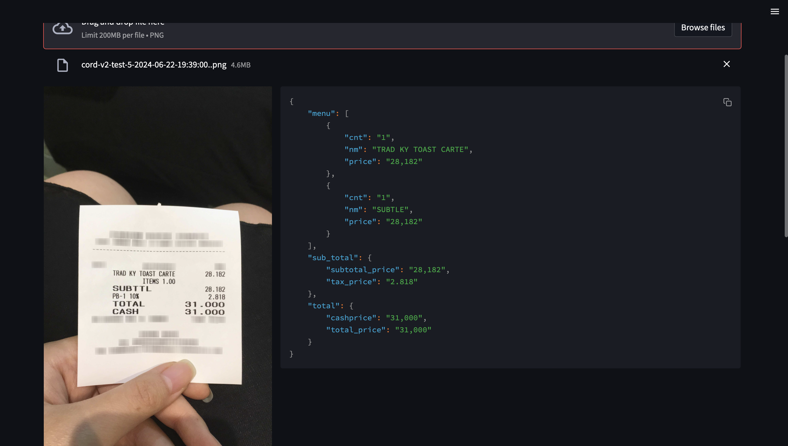
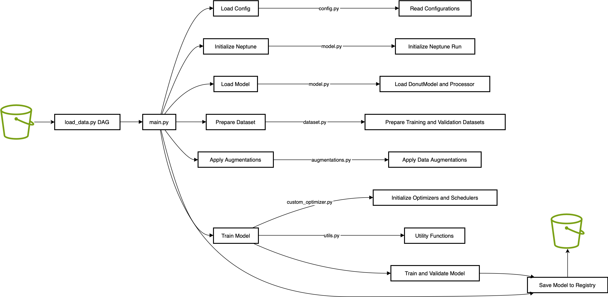
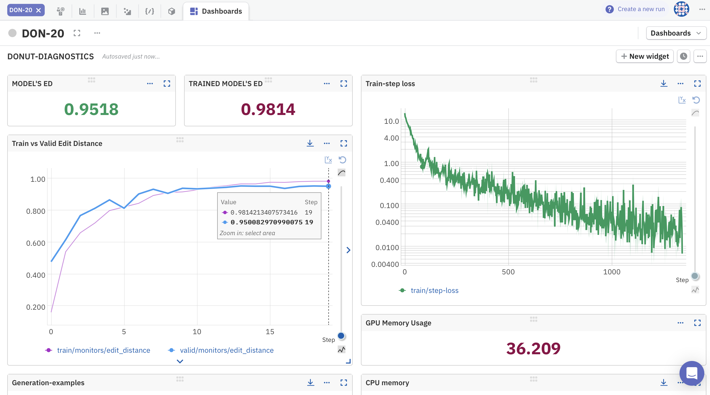
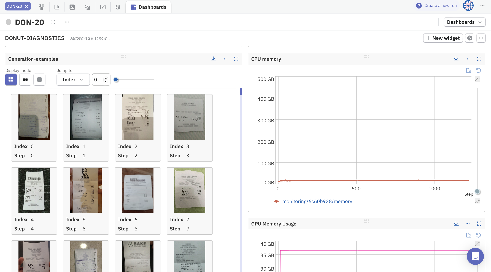
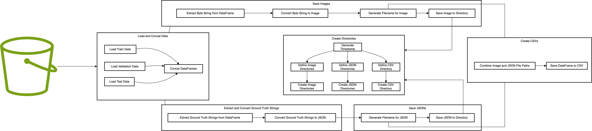

# Deployment (2024-06-26) :
- **App Development**: The `app.py` script uses Streamlit to create a web application that allows users to upload receipt images and receive JSON outputs.
- **Model Loading**: The trained model is loaded in `app.py`, along with the DonutProcessor for processing the inputs.
- **Prediction Generation**: The app processes uploaded images, applies necessary augmentations, and uses the trained model to generate and display JSON predictions.
- **Dockerization**: The `app.py` script is dockerized, creating a container image of the application.
- **Artifact Registry**: The Docker image is pushed to the Google Artifact Registry.
- **Cloud Run Deployment**: The Docker image is deployed on Google Cloud Run, providing a scalable and managed platform to run the application.
- **GCP Bucket Storage**: The input images and corresponding output JSONs are stored in a Google Cloud Storage bucket for persistent storage and access.

# Model Training Pipeline (2024-06-15)

1. Run `load_data.py` DAG to retrieve and prepare the dataset:
    - Ensure `load_data.py` is correctly set up to download and prepare the necessary data.
    - Run the `load_data.py` DAG to download the data and store it in the specified directory, making it ready for training.

2. Configure the training parameters in `config.py`:
    - Open `config.py` and review the parameters.
    - Modify any parameters as needed to fit your specific training requirements, including data paths, model paths, image processing parameters, optimizer and scheduler parameters, etc.

3. Prepare the training and validation datasets using `DonutDataset` in `dataset.py`:
    - Ensure your data CSV files (train, valid, and test) are correctly referenced in `config.py`.
    - The `DonutDataset` class will load and preprocess the data as specified.

4. Initialize and load the model in `model.py`:
    - Ensure the `donut_model_0_0_1.pt` model file is in the correct directory as specified in `config.py`.

5. Apply data augmentations using the `Transforms` class in `augmentations.py`:
    - Review and customize the augmentations as needed in `augmentations.py`.
    - Augmentations are applied during dataset preparation.

6. Train the model using `main.py`:
    - Run `main.py` to start the training process.
    - The script will load configurations, initialize Neptune for logging, prepare datasets, apply augmentations, and train the model.
    - Training logs and metrics are sent to Neptune, and the model is saved to the model registry based on the specified criteria.
    
    

7. Save the best model based on the evaluation metrics specified in `config.py`:
    - Ensure `save_best_model`, `save_on_metric`, and `save_model_at_every_epoch` parameters are set correctly.
    - The best model is saved to the model registry after training.

# Data Pipeline (2024-06-10) : Data Pipeline in Airflow:

This section introduces the new data pipeline for the CORD-v2 dataset, implemented using
Apache Airflow. The pipeline automates the process of handling the dataset, from loading and
concatenating data to extracting and converting data, saving images, creating directories, and
finally saving the JSON and CSV files. 

The CORD-v2 (Consolidated Receipt Dataset) is an open-source dataset created by Naver Clova
AI. It consists of scanned images of receipts from various stores, annotated with detailed
information including item names, quantities, prices, and total amounts.

## Key Features:
- **Data Format**: Includes images of receipts and corresponding JSON files with structured
annotations.
- **Annotations**: Provides information on item names, quantities, prices, subtotals, and total
amounts.
- **Splits**: Divided into training, validation, and test sets with 800, 100, and 100 images
respectively.

## Data Source:

This dataset is ideal for training and evaluating OCR-free document understanding models,
particularly for tasks like information extraction and automated data entry.
Size of downloaded dataset files: 2.31 GB
For more details, visit the CORD-v2 Dataset page on Hugging Face.

## Data Pipeline architecture 

